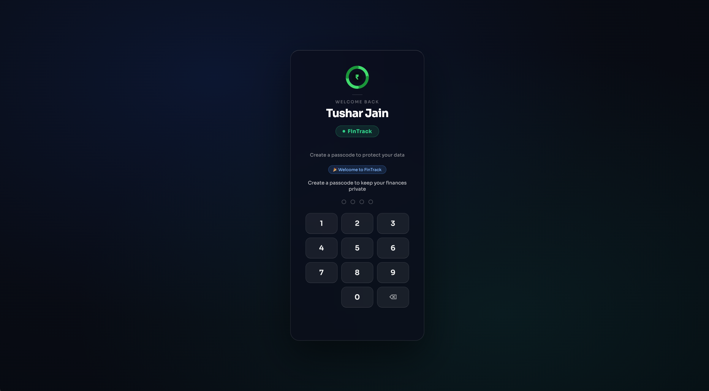
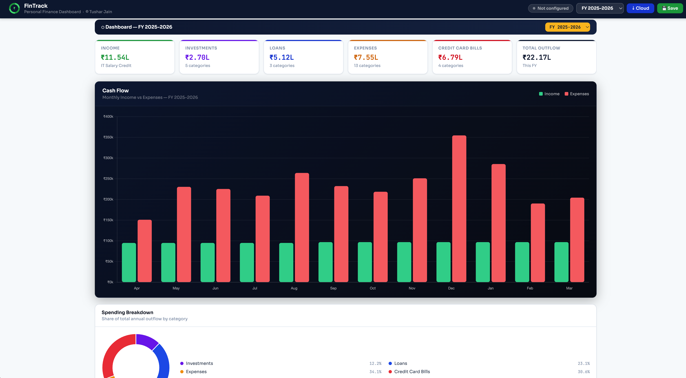
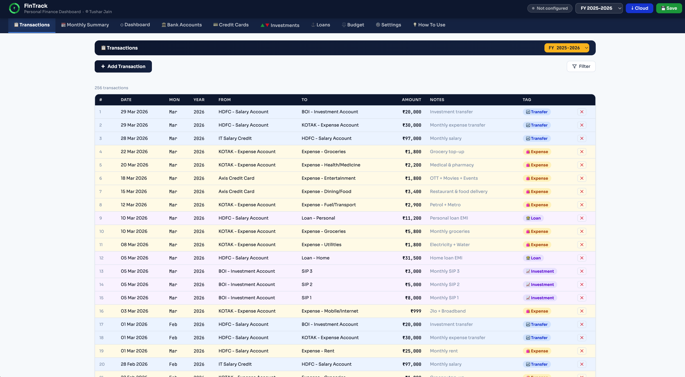
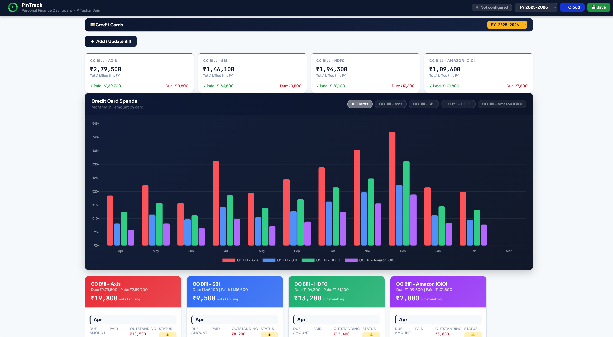
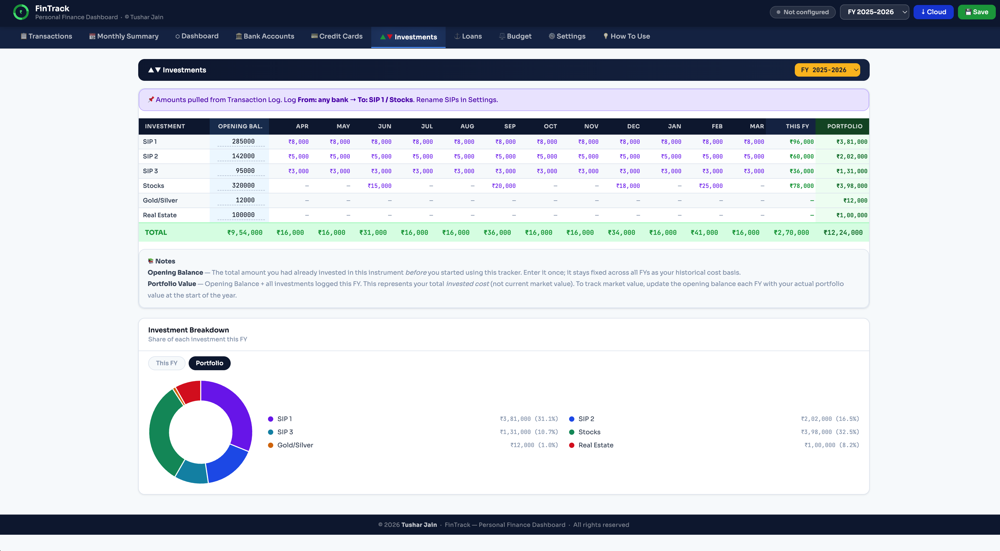
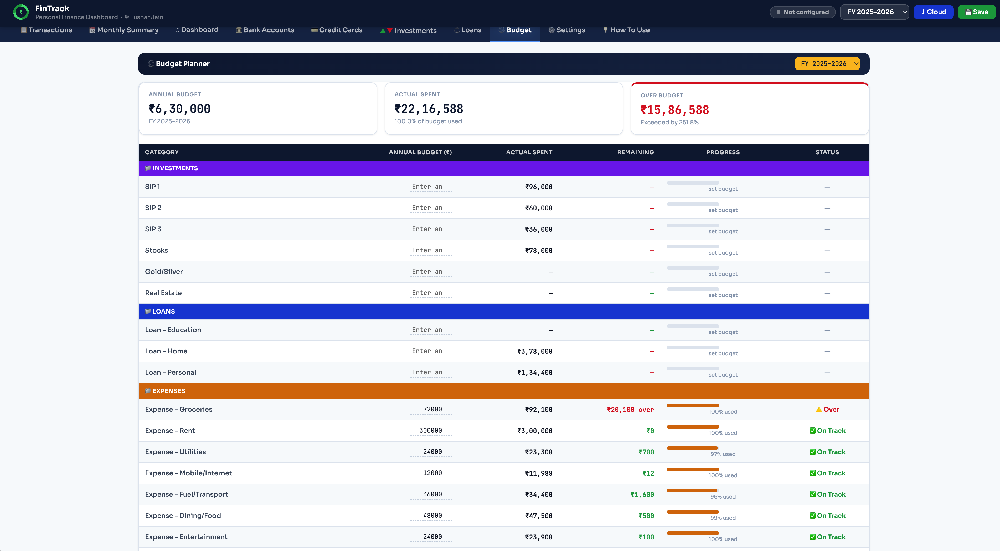

# FinTrack — Personal Finance Dashboard

**FinTrack** is a fully self-contained, personal finance dashboard — no frameworks, no server, no installation required. You simply download one `.html` file, open it in any browser, and your entire financial tracking system is ready to use. All data is saved locally in your browser's `localStorage`.

> It was designed for the Indian financial context — amounts are displayed in ₹ (Indian Rupees) with proper Lakh/Crore formatting — but the structure and concepts are universally applicable.

> No backend. No subscription. No data leaves your device.

Built with the assistance of **[Claude](https://claude.ai)** by Anthropic



---

## ✨ Features

| Feature | Description |
|---|---|
| 📊 **Dashboard** | Cash flow chart, spending donut, dynamic KPI cards per category |
| 📋 **Transactions** | Full transaction log with slide-down entry, advanced filters, FY selector |
| 💳 **Credit Cards** | Bill tracking, payment attribution, per-card spend chart with filter pills |
| 🏦 **Bank Accounts** | Running balance, opening balance, monthly inflow/outflow table |
| 📈 **Investments** | Opening balance, monthly log, portfolio value, This FY vs Portfolio pie chart |
| 📅 **Budget Planner** | Annual budget vs actual spend, progress bars, overrun alerts |
| 🏠 **Loan Tracker** | EMI schedule, interest rate history, loan month attribution |
| 📊 **Monthly Summary** | KPIs and category breakdown across all sections |
| ⚙️ **Settings** | Fully customisable categories, banks, credit cards — everything is dynamic |
| ☁️ **Cloud Sync** | JSONbin.io integration for cross-device backup |
| 🔒 **Lock Screen** | 4-digit passcode with auto-lock timer |

---

## 📸 Screenshots

### Dashboard


### Transactions


### Credit Cards


### Investment Tab


### Budget Planner


---

## 🚀 Quick Start

### Option 1 — Use Online (GitHub Pages)
Visit the live app: **[FinTrack-Personal_Finance_Dashboard](https://tusharjain07.github.io/FinTrack-Personal_Finance_Dashboard/)**

No installation needed — opens directly in your browser.

### Option 2 — Run Locally
1. Download `index.html` from this repository
2. Open it in any modern browser (Chrome, Firefox, Edge, Safari)
3. That's it — fully functional offline

---

## 🛠️ Setup Guide

### First Time
1. **Set your Profile** — Settings → Profile → Enter your name and a 4-digit passcode
2. **Customise Categories** — Settings → Transaction To → Rename SIPs, add expense categories
3. **Add Banks & Cards** — Settings → Transaction From → Add your bank accounts and credit cards
4. **Log Transactions** — Transactions tab → + Add Transaction

### Cloud Sync (Optional)
1. Create a free account at [jsonbin.io](https://jsonbin.io)
2. Generate an API Key and create a Bin
3. Go to Settings → Cloud Sync → Enter API Key and Bin ID
4. Use **↓ Cloud** in the top bar to sync across devices

---
## Security Architecture

### Lock Screen
- A **4-digit PIN** protects the entire dashboard
- PIN is hashed with **SHA-256** (Web Crypto API) — the raw PIN is never stored
- **Security question + answer** (also SHA-256 hashed) enables passcode reset
- **Auto-lock**: configurable timeout (15 min to 8 hours); always locks on new device/session
- **3 wrong attempts** → 30-second lockout
- **Inactivity timer**: auto-locks after 5 minutes of no interaction

---
## 🔒 Privacy

- **No data collection** — zero analytics, zero tracking, zero third-party services
- **No account required** — works completely offline
- **Your data stays on your device** — unless you explicitly set up Cloud Sync
- **Open source** — full source is visible in this repository

---

## 💡 How It Works

Everything flows from the **Transaction Log**. You log one transaction and every tab updates automatically:

```
You log:  From: HDFC Bank  →  To: Axis Credit Card Bill  →  ₹15,000  →  Date: 15-Jun
                    ↓
  ✅ Bank tab        — HDFC balance reduced by ₹15,000
  ✅ Credit Card tab — Axis card shows ₹15,000 paid, payment date updated, status → Fully Paid
  ✅ Dashboard       — Expense KPI updated
  ✅ Monthly Summary — June outflow updated
  ✅ Budget tab      — CC Bills category actual spend updated
```

---

## 🏗️ Technical Details

| Aspect | Detail |
|---|---|
| **Architecture** | Single HTML file — HTML + CSS + JavaScript |
| **Dependencies** | Chart.js 4.4.0 (CDN only) |
| **Data Storage** | Browser localStorage (`ft_v8` key) |
| **Cloud Backup** | JSONbin.io REST API |
| **File Size** | ~210KB |
| **Compatibility** | Any modern browser — Chrome, Firefox, Edge, Safari |
| **Framework** | None — vanilla JS only |
| **Lines of Code** | ~3,000 JS + ~500 HTML/CSS |

---

## 🎨 Design Highlights

- **Dark theme charts** — Cash Flow and CC Spend charts use deep navy backgrounds with neon-bright bars
- **Auto colour palette** — Banks and credit cards automatically get distinct colours (coral, blue, green, violet, amber...) by position — no manual config needed
- **Dynamic KPI grid** — KPI cards fill the full tab width equally; extra cards scroll right without shrinking existing ones
- **Slide-down panels** — Add Transaction, Filter, CC Bill entry, Settings all use smooth slide-down animations
- **FY dropdown** — Every tab has its own Financial Year selector embedded in the header pill
- **Indian FY** — April–March financial year with ₹ formatting and `en-IN` locale

---

## 📦 What's Dynamic (Nothing Hardcoded)

- **Banks** — Add in Settings → appear in Bank tab automatically
- **Credit Cards** — Add in Settings → appear in CC tab with auto colour
- **Categories** — Add/rename in Settings → update everywhere (Dashboard, Budget, Monthly Summary)
- **Financial Year** — Range 2020–2099, auto-detects current FY on first load
- **KPI cards** — One card per category section — add a section, get a KPI card automatically

---

## 🤝 Contributing

This project is open source. If you find a bug or want to suggest a feature:

1. Open an **Issue** on GitHub
2. Or fork the repo and submit a **Pull Request**

---

## 📄 Licence

© 2026 Tushar Jain. All rights reserved.

This project is made available for personal use. You are free to:
- Use it for personal finance tracking
- Fork it and customise it for your own use
- Share it with attribution to the original author

You may not:
- Remove or modify the copyright notice
- Redistribute it as your own work
- Use it for commercial purposes without permission

---

## 👤 Author

**Tushar Jain**

Built with the assistance of [Claude](https://claude.ai) by Anthropic — demonstrating AI-assisted development through iterative prompt engineering, feature design and debugging.

- 🔗 [LinkedIn](https://www.linkedin.com/in/tusharjain07/)
- 💻 [GitHub](https://github.com/TusharJain07)

---


---

*If FinTrack helps you manage your finances better, consider giving it a ⭐ on GitHub!*
